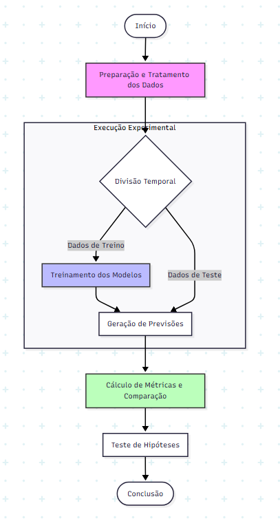

# 📘 Plano de Experimento – Entrega 1
### Tema: Análise estatística e modelagem de sazonalidade de vendas em múltiplos segmentos de uma empresa de arames utilizando técnicas de Inteligência Artificial

---

## 1. Identificação Básica

### 1.1 Título do Experimento
**Avaliação do desempenho de modelos de IA na detecção de padrões sazonais de vendas por segmento em uma empresa de arames**

### 1.2 ID / Código
**EXP-SAZ-IA-001**

### 1.3 Versão do Documento e Histórico de Revisão

| Versão | Data       | Autor       | Descrição                                   |
|--------|------------|-------------|---------------------------------------------|
| v1.0   | 21/11/2025 | Luiz Felipe | Entrega 1 — Identificação e Contexto        |

### 1.4 Datas
- **Criação:** 21/11/2025  
- **Última atualização:** 21/11/2025

### 1.5 Autores
- **Nome:** Luiz Felipe  
- **Área:** Engenharia de Software  
- **Contato:** `lfcamposdemorais@gmail.com`

### 1.6 Responsável Principal (PI / Dono do Experimento)
**Luiz Felipe**

### 1.7 Projeto / Produto / Iniciativa Relacionada
Projeto de TCC: aplicação de métodos estatísticos e Inteligência Artificial para modelar e prever padrões sazonais de vendas, apoiando planejamento de estoque e produção em empresa do setor de arames.

---

## 2. Contexto e Problema

### 2.1 Descrição do Problema / Oportunidade
Empresas do setor metalúrgico, especialmente fabricantes de arames, apresentam grandes variações de demanda ao longo do ano. Atualmente, previsões são feitas com técnicas simples e sem análise segmentada, prejudicando planejamento de estoque, produção e logística.

**Problema principal:**  
A organização não possui um método robusto — baseado em estatística e IA — para identificar e medir a sazonalidade das vendas por segmento.

**Oportunidade:**  
Aplicar modelos estatísticos e técnicas de IA para detectar padrões sazonais, melhorar previsões e apoiar decisões operacionais.

### 2.2 Contexto Organizacional e Técnico
- **Setor:** indústria metalúrgica (empresa de arames, cenário simulado).  
- **Dados disponíveis:** histórico de vendas por segmento (datas, quantidades, receita).  
- **Ferramentas previstas:** Python (Pandas, Statsmodels, Prophet, Scikit-Learn), Jupyter Notebook, GitHub.  
- **Ambiente:** análise orientada a dados + automação com scripts.  
- **Motivação técnica:** introduzir IA no processo decisório do setor industrial.

### 2.3 Trabalhos e Evidências Prévias
#### Internos (simulados)
- Planilhas indicando que alguns segmentos têm picos e quedas sazonais.  
- Análises básicas sem suporte estatístico formal.

#### Externos (literatura)
- Previsão de demanda baseada em IA tem sido crescente na indústria.

### 2.4 Referencial Teórico e Empírico Essencial
- **Séries temporais:** tendência, sazonalidade, ruído, estacionariedade.  
- **Suporte teórico:** IA aumenta precisão ao capturar padrões não-lineares e comportamento específico por segmento.

---

# 🧪 Escopo do Experimento e Modelo GQM

## 3. Escopo do Experimento

### 3.1 O que está Dentro do Escopo
- Análise de séries temporais de vendas por segmento.
- Avaliação de modelos estatísticos.
- Avaliação de modelos de IA.
- Medição da presença e intensidade da sazonalidade.
- Comparação de acurácia entre modelos.
- Análise segmentada (mínimo 3 segmentos distintos).

### 3.2 O que está Fora do Escopo
- Previsões de demanda em tempo real.
- Integração com sistemas corporativos.
- Otimização de produção e logística.
- Desenvolvimento de sistema web ou dashboards interativos.
- Análise de fatores econômicos externos (ex.: inflação, PIB, câmbio).

### 3.3 Restrições
- Base de dados limitada ao histórico disponibilizado (anos passados).
- Não inclusão de variáveis externas (somente dados internos).
- Treino e teste executados em ambiente acadêmico (notebooks).

### 3.4 Premissas
- Os dados fornecidos estão corretos e adequadamente registrados.
- Cada segmento possui comportamento distinto e comparável.
- Os modelos estatísticos e de IA podem ser avaliados com métricas padronizadas.

---

# 🎯 Modelo GQM (Goal – Question – Metric)

## Objetivo Geral
Avaliar a eficácia de modelos estatísticos e de IA na identificação e previsão da sazonalidade de vendas em múltiplos segmentos de uma empresa do setor de arames.

---

# 🎯 Objetivos Específicos + Perguntas + Métricas (GQM)

## Objetivo 1 – Identificar se existe sazonalidade significativa em cada segmento
| Pergunta | Métricas |
|---------|----------|
| Q1.1: Existe sazonalidade estatisticamente significativa? | M1: Índice de Sazonalidade, M2: Teste de Estacionariedade |
| Q1.2: Qual é o período sazonal dominante? | M3: Periodicidade Detectada, M4: Correlação  |
| Q1.3: Qual a intensidade da sazonalidade? | M1: Índice de Sazonalidade, M5: Amplitude Sazonal |

---

## Objetivo 2 – Avaliar a acurácia dos modelos de previsão
| Pergunta | Métricas |
|---------|----------|
| Q2.1: Os modelos estatísticos superam modelos de IA? | M6: MAE (Erro Médio Absoluto), M7: RMSE (Raiz Quadrada Média do Erro) |
| Q2.2: Qual modelo apresenta previsões mais estáveis no tempo? | M8: Variância do Erro, M6: MAE (Erro Médio Absoluto) |
| Q2.3: Há diferença significativa entre erros dos modelos? | M9: Teste de Wilcoxon, M7: RMSE (Raiz Quadrada Média do Erro) |

---

## Objetivo 3 – Comparar o desempenho entre segmentos diferentes
| Pergunta | Métricas |
|---------|----------|
| Q3.1: Segmentos possuem diferenças significativas de sazonalidade? | M1: Índice de Sazonalidade, M5: Amplitude Sazonal |
| Q3.2: Segmentos possuem previsões mais fáceis (menor erro)? | M6: MAE (Erro Médio Absoluto), M7: RMSE (Raiz Quadrada Média do Erro) |
| Q3.3: Segmentos respondem melhor a modelos estatísticos ou IA? | M6: MAE (Erro Médio Absoluto), M10: MAPE (Erro Percentual Absoluto Médio) |

---

## Objetivo 4 – Medir o impacto da segmentação nos resultados
| Pergunta | Métricas |
|---------|----------|
| Q4.1: A previsão segmentada é melhor que a previsão agregada? | M10: MAPE (Erro Percentual Absoluto Médio), M7: RMSE |
| Q4.2: A segmentação reduz erro em períodos de pico de sazonalidade? | M5: Amplitude Sazonal, M6: MAE (Erro Médio Absoluto) |
| Q4.3: A segmentação melhora previsões em períodos de baixa demanda? | M6: MAE (Erro Médio Absoluto), M8: Variância do Erro |

---

# 📊 Lista Completa de Métricas (com Descrição e Unidade)

| Código | Métrica | Descrição | Unidade |
|--------|---------|-----------|---------|
| M1 | Índice de Sazonalidade | Mede o grau de repetição anual do padrão | % |
| M2 | Teste ADF | Teste estatístico de estacionariedade | estatístico / p-value |
| M3 | Periodicidade Detectada | Comprimento do ciclo sazonal | períodos |
| M4 | ACF | Autocorrelação da série | coef. (-1 a 1) |
| M5 | Amplitude Sazonal | Diferença entre picos e vales | unidade da série |
| M6 | MAE | Erro médio absoluto | unidade da série |
| M7 | RMSE | Raiz do erro quadrático médio | unidade da série |
| M8 | Variância do Erro | Mede estabilidade das previsões | unidades² |
| M9 | Teste de Wilcoxon | Teste estatístico de diferença de medianas | estatístico / p-value |
| M10 | MAPE | Erro percentual absoluto médio | % |

## 4. Modelo Conceitual e Hipóteses

### 4.1 Modelo Conceitual
O experimento se baseia em uma estrutura de **Entrada-Processamento-Saída**:

1.  **Entrada:** Séries temporais históricas de vendas de arames divididas por segmentos (dados brutos).
2.  **Processamento:** Aplicação de tratamentos algorítmicos distintos:
    * Modelos Estatísticos Clássicos (Baseline).
    * Modelos de Machine Learning (Regressores).
    * Modelos de Séries Temporais Modernos (Prophet).
3.  **Saída:** Previsões de demanda futura e métricas de erro calculadas sobre uma base de teste oculta.

### 4.2 Hipóteses do Experimento

**H1 (Desempenho da IA vs Estatística)**
* **H0:** Não há diferença estatisticamente significativa entre a acurácia (RMSE) dos modelos estatísticos tradicionais e dos modelos de IA.
* **H1:** Os modelos de IA apresentam menor erro de previsão (RMSE) do que os modelos estatísticos tradicionais.

**H2 (Impacto da Segmentação)**
* **H0:** A modelagem agregada (empresa toda) possui o mesmo desempenho (MAPE) que a soma das modelagens segmentadas.
* **H1:** A modelagem individual por segmento resulta em um erro percentual (MAPE) menor do que a modelagem agregada.

**H3 (Sazonalidade)**
* **H0:** A intensidade da sazonalidade é uniforme entre todos os segmentos de arames.
* **H1:** Existem diferenças estatisticamente significativas na amplitude sazonal entre os diferentes segmentos.

---

## 5. Variáveis, Fatores e Tratamentos

### 5.1 Variáveis do Estudo

| Tipo de Variável | Nome da Variável | Descrição | Escala/Unidade |
| :--- | :--- | :--- | :--- |
| **Dependente** | Erro Médio Absoluto (MAE) | Média da diferença absoluta entre valor previsto e real. | Numérica (Kg ou R$) |
| **Dependente** | RMSE | Raiz do Erro Quadrático Médio (penaliza grandes erros). | Numérica (Kg ou R$) |
| **Dependente** | MAPE | Erro Percentual Absoluto Médio. | Percentual (%) |
| **Dependente** | Amplitude Sazonal | Diferença entre o pico e o vale do ciclo sazonal. | Numérica |
| **Independente** | Tipo de Modelo | A técnica utilizada para realizar a previsão. | Nominal (Categórica) |
| **Independente** | Segmento de Produto | Categoria do arame (Indústria, Agro, Varejo). | Nominal (Categórica) |
| **Controle** | Janela de Treinamento | Período dos dados usados para treinar (ex: 2019-2023). | Temporal |
| **Controle** | Horizonte de Previsão | Quantidade de meses a prever (ex: 12 meses). | Numérica |

### 5.2 Fatores e Tratamentos
O experimento utiliza um **Desenho Fatorial Completo** (3 Técnicas x 3 Segmentos).

**Fator A: Técnica de Previsão**
* **A1:** Modelo Estatístico (ARIMA/Holt-Winters) - *Baseline*
* **A2:** Modelo de ML (Random Forest Regressor)
* **A3:** Modelo Híbrido/Facebook (Prophet)

**Fator B: Segmento de Mercado**
* **B1:** Indústria
* **B2:** Varejo/Construção
* **B3:** Agro

### 5.3 Tabela de Combinações (Execuções)

| ID Execução | Combinação | Descrição |
| :--- | :--- | :--- |
| E1 | A1 + B1 | ARIMA no segmento Indústria |
| E2 | A2 + B1 | Random Forest no segmento Indústria |
| E3 | A3 + B1 | Prophet no segmento Indústria |
| E4 | A1 + B2 | ARIMA no segmento Varejo |
| E5 | A2 + B2 | Random Forest no segmento Varejo |
| E6 | A3 + B2 | Prophet no segmento Varejo |
| E7 | A1 + B3 | ARIMA no segmento Agro |
| E8 | A2 + B3 | Random Forest no segmento Agro |
| E9 | A3 + B3 | Prophet no segmento Agro |

---

## 6. População, Sujeitos e Amostragem

### 6.1 População e Amostra
* **População:** Histórico completo de transações de vendas da empresa.
* **Amostra:** Dados agregados mensalmente de **Jan/2019 a Dez/2024**.
    * *Treino:* Jan/2019 a Dez/2023.
    * *Teste:* Jan/2024 a Dez/2024.

### 6.2 Técnica de Amostragem
Amostragem não-probabilística por conveniência (utilização da base histórica disponível), com divisão temporal estrita para evitar *data leakage* (vazamento de dados futuros no treino).

---

## 7. Instrumentação e Protocolo Operacional

### 7.1 Stack Tecnológico
* **Linguagem:** Python 3.9+
* **Ambiente:** Jupyter Notebook
* **Bibliotecas:** Pandas (ETL), Statsmodels (ARIMA), Scikit-Learn (Random Forest, Metrics), Prophet, Seaborn (Visualização).

### 7.2 Fluxograma do Experimento

### 7.3 Protocolo Operacional (Passo a Passo)

Para garantir a reprodutibilidade do experimento, será seguido o seguinte roteiro:

1.  **Ingestão de Dados:** Leitura dos arquivos `.csv` contendo o histórico de vendas.
2.  **Pré-processamento:**
    * Remoção de registros inválidos (devoluções/valores negativos).
    * Agrupamento dos dados por `[Data, Segmento]`.
    * Tratamento de *missing values* (interpolação linear se necessário).
3.  **Engenharia de Features:** * Criação de variáveis temporais (mês, trimestre, ano).
    * Criação de variáveis de defasagem (*lags*) para os modelos de ML.
4.  **Treinamento (Fase de Ajuste):**
    * Otimização dos parâmetros do ARIMA (p,d,q) via *GridSearch*.
    * Treinamento do Random Forest e do Prophet utilizando a base de treino (2019-2023).
5.  **Inferência (Previsão):** Geração de previsões para os 12 meses da base de teste (2024), sem que o modelo "veja" os dados reais.
6.  **Coleta de Dados:** Armazenamento dos resultados em uma tabela consolidada contendo: `[Data, Segmento, Modelo, Valor_Real, Valor_Previsto, Erro_Absoluto]`.

### 7.4 Plano de Análise de Dados (Pré-execução)

A análise estatística dos resultados seguirá as etapas abaixo para validar as três hipóteses principais:

**Passo 1: Verificação de Normalidade**
* Aplicar o **Teste de Shapiro-Wilk** nos resíduos (erros) de cada modelo para definir se usaremos testes paramétricos ou não-paramétricos.

**Passo 2: Teste da Hipótese 1 (IA vs Estatística)**
* Comparar a distribuição dos erros absolutos do ARIMA *versus* Prophet/Random Forest.
* *Teste Estatístico:* **Teste de Wilcoxon Signed-Rank** (caso os erros não sejam normais) ou **Teste T Pareado**.
* *Critério:* Se p-valor < 0.05, rejeita-se H0, confirmando que há diferença significativa de desempenho.

**Passo 3: Teste da Hipótese 2 (Segmentação)**
* Comparar o MAPE global da "soma das previsões segmentadas" *versus* o MAPE da "previsão única agregada".
* Análise descritiva da redução percentual do erro.

**Passo 4: Teste da Hipótese 3 (Sazonalidade)**
* Comparar as amplitudes sazonais (diferença pico-vale) entre os segmentos.
* *Teste Estatístico:* **Teste de Kruskal-Wallis** para verificar se as medianas de sazonalidade diferem entre os grupos (Indústria, Varejo, Agro).

**Passo 5: Avaliação Visual e Prática**
* Plotagem de gráficos de linha (Série Real vs. Prevista) para inspeção visual do ajuste.
* Tabela final de ranking dos modelos por segmento baseada no RMSE.

## 8. Avaliação de Validade

A validade do experimento determina o grau de confiança que podemos ter nos resultados (interna) e a capacidade de generalizá-los (externa).

### 8.1 Validade Interna
*Refere-se à certeza de que o tratamento (modelo de previsão) é a causa real do resultado observado (erro de previsão), e não fatores externos, erros de execução ou "sorte".*

| Ameaça | Descrição no Contexto do Experimento | Estratégia de Mitigação |
| :--- | :--- | :--- |
| **Vazamento de Dados (Data Leakage)** | O risco de o modelo ter acesso acidental a informações de 2024 durante o treinamento, o que geraria métricas de acurácia artificialmente altas. | **Divisão Temporal Estrita:** Garantia via código de que o conjunto de treino (2019-2023) é separado cronologicamente do conjunto de teste (2024), sem janelas deslizantes aleatórias que misturem futuro e passado. |
| **História / Eventos Exógenos** | Eventos atípicos que afetam a série temporal (ex: Pandemia de COVID-19 em 2020/21) e podem distorcer o aprendizado do padrão "normal" de sazonalidade. | **Análise de Robustez:** Testar os modelos com e sem o período crítico da pandemia ou utilizar variáveis binárias (*dummy vars*) para sinalizar esses períodos, permitindo que o modelo isole o efeito anômalo. |
| **Maturação dos Dados** | Mudanças na forma como a empresa registra as vendas ao longo dos anos (ex: reclassificação de produtos ou mudança de sistema ERP). | **Pré-processamento e Normalização:** Verificação da consistência das categorias de produtos e segmentos em todo o histórico antes da ingestão nos modelos. |
| **Instrumentação** | Erros na implementação dos cálculos de erro (bugs no código Python). | **Uso de Bibliotecas Padrão:** Utilização de funções validadas do *Scikit-Learn* (`mean_absolute_error`, `rmse`) em vez de reimplementar fórmulas matemáticas manualmente. |

### 8.2 Validade Externa
*Refere-se à capacidade de generalizar os resultados deste experimento para outros contextos (outras empresas, outros períodos ou outros produtos).*

| Ameaça | Descrição no Contexto do Experimento | Estratégia de Mitigação |
| :--- | :--- | :--- |
| **Representatividade da Amostra** | O experimento utiliza dados de apenas uma empresa de arames. Os resultados podem não se aplicar a todo o setor metalúrgico ou siderúrgico. | **Delimitação de Escopo:** O trabalho assume que a solução é específica para o contexto da empresa parceira. A generalização reivindicada é sobre a **metodologia** de comparação (GQM + Experimentação), e não sobre os hiperparâmetros específicos dos modelos. |
| **Validade Temporal** | Um modelo treinado hoje pode perder validade no futuro se houver mudanças estruturais no mercado (ex: entrada de novos concorrentes ou novas tecnologias). | **Protocolo de Retreino:** A proposta final incluirá uma recomendação de *retreino periódico* (ex: trimestral) dos modelos com dados novos para manter a aderência à realidade do mercado. |
| **Especificidade dos Segmentos** | Os segmentos analisados (Indústria, Agro, Varejo) podem ter comportamentos cíclicos muito específicos que não se repetem em outros nichos de mercado. | **Diversidade de Testes:** A escolha proposital de 3 segmentos com dinâmicas diferentes (Agro depende de safra, Indústria depende de PIB) serve para testar se os modelos conseguem generalizar o aprendizado para diferentes tipos de sazonalidade. |

